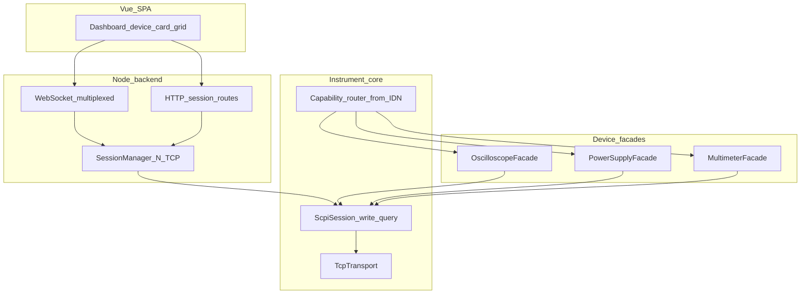
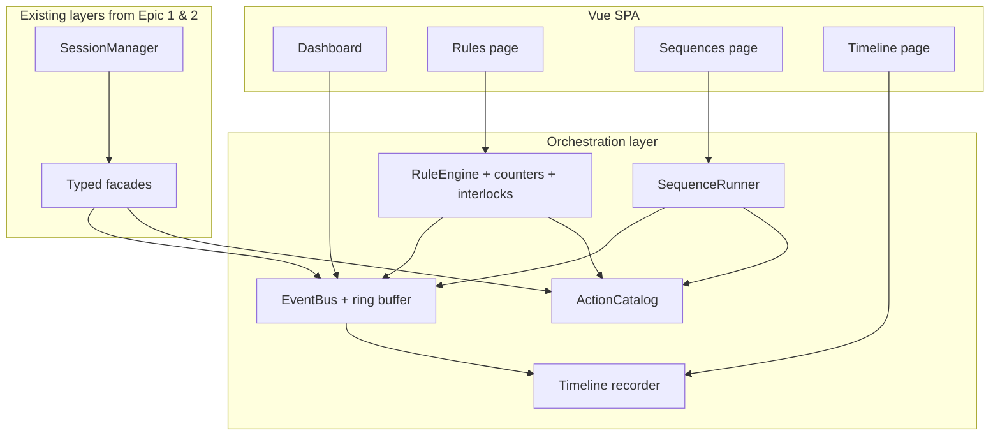

# LXI webapp: generic client (Epic 1) + multi-device dashboard (Epic 2)

## Purpose, audience, and product voice

- **Purpose:** A **browser dashboard** for **LXI-style LAN instruments** (SCPI over TCP): **connect several devices**, see **live state**, run **typed controls** per device class, and fall back to **raw SCPI** when there is no driver — without treating each vendor’s full PC app as the only way to work at the bench.
- **Audience:** **Solo engineers**, **makers**, and **small-lab** use: you understand **host, port, and `*IDN?`**, you run on a **trusted LAN**, and you want **clarity and control** more than enterprise IT features (no SSO, no audit multi-tenancy in v1).
- **Product voice / look-and-feel defaults:** **Utility-first bench software** — calm **neutral** chrome (light/dark per factsheet), **numbers and labels easy to scan**, **color used mainly for state** (connected / error / output on), not decoration. **One icon set** for the whole app (default at implementation: **Lucide**). **Locale:** **English** is the authoring baseline; **Epic 6.4** adds
**translated UI** in the Vue app (`packages/web`) with locale-aware
formats — see Epic 6. **User manual + VitePress** stay English-only.

---

## Product scope — keep functionality sensible

- **One operator, one deployment.** A single person (or one lab machine) runs the **Node backend** and uses the **Vue UI** in a browser. This is a **local bench utility**, not a cloud application. Accounts, roles, tenants, and per-user quotas are **not** part of the product — the LXI instruments themselves accept SCPI over raw TCP without authentication, so adding a login layer in the dashboard would be security theatre unless the operator also owns the network isolation (which is the documented posture: bind to a trusted LAN only).
- **“Multi-session” means multi-instrument.** The backend holds **several TCP connections at once** so you can see your scope, PSU, and DMM together. That is **one** UI session talking to **one** backend process, not many unrelated users on a shared network.
- **Prioritise features that help one person control lab gear:** reliable connect/disconnect, clear per-device state, safe defaults (e.g. confirm destructive actions, avoid surprise `*RST`), readable errors, visible device-error queue, per-session SCPI transcript, a panic-stop kill switch, and predictable API shapes. Add complexity only when a concrete workflow needs it.

---

## Pre-implementation — resolve before writing code

**Rule:** if something is **not** listed in **Implementation factsheet** below, pause and ask rather than guessing.

---

## Implementation factsheet (locked — use when building)

Use this section as the single checklist of defaults; **no need to re-ask** these in chat unless hardware or requirements change.

### Monorepo and package names

- **Package manager:** **pnpm** workspaces (`pnpm-workspace.yaml`).
- **Published / internal package names:** **`@lxi-web/core`**, **`@lxi-web/server`**, **`@lxi-web/web`** (directories can stay `packages/core`, `packages/server`, `packages/web` — map in each `package.json` `name` field).

### Runtime and server

- **Node:** **>= 24** (`engines` in root).
- **HTTP:** **Fastify** in `@lxi-web/server`.
- **WebSocket:** **`@fastify/websocket`** (official plugin; no separate `ws`-only server unless you hit a blocker).
- **API listen:** default **`127.0.0.1`**; **`HOST`** env overrides bind (e.g. `0.0.0.0` for LAN). Document trusted-network caveat in `README`.
- **API port:** default **`8787`**; override with **`PORT`** env. Vite dev **proxies** `/api` and `/ws` (or equivalent) to this port.

### HTTP vs WebSocket (transport rules of thumb)

The same Fastify process exposes both; pick per use case:

- **WebSocket (`/ws`)** — one long-lived connection per browser tab. Used for anything that updates continuously: session lifecycle (`sessions:init/update/removed`) **and** recurring instrument readings via `subscribe` / `unsubscribe` + `reading:update` / `reading:error` frames. The server runs **one scheduler loop per `(sessionId, topic)`** regardless of how many panels are subscribed, so the dashboard mini tile and detail page share a single device poll. Reading topics live in `@lxi-web/core` (`ReadingTopic`); v1 covers `dmm.reading`, `dmm.dualReading`, `psu.channels`, `scope.channels`, `scope.timebase`. New recurring feeds are added by extending the topic union and the server-side scheduler map; the browser uses the `useLiveReading` composable. See [docs/steps/2-2-rest-and-websocket.md § Live reading subscriptions](docs/steps/2-2-rest-and-websocket.md#live-reading-subscriptions).
- **REST (`/api/...`)** — one-shot reads and writes. Capability descriptors (ranging, trigger, math, temperature, presets…), user-initiated commands (mode change, Apply, preset save/recall), post-write snappy refreshes of the WS-backed state, binary downloads (scope screenshot / CSV), and the raw-SCPI escape hatch all stay on HTTP. REST endpoints for WS-backed topics are **retained** as a fallback for scripting, curl-testing, and post-write refresh.
- **Rule of thumb:** if multiple panels want the same value at a fixed cadence, it belongs on WebSocket. If a query is driven by navigation or user action and returns once, it stays on REST.

### Instrument TCP (lab side)

- **Default SCPI port in UI:** **5025** (common for Rigol/LAN); remain overridable per connection. Not the same as the API port **8787**.

### Frontend

- **Vue 3** + **Vite** + **Vue Router** + **TypeScript** + **Tailwind**.
- **State:** **Pinia** for sessions list, selected `sessionId`, WebSocket client handle, and UI chrome.
- **Charts:** **uPlot** for scope waveforms and compact numeric history/sparklines where needed; keep **CSV export** (and/or a simple data table) for accessibility alongside charts.

### Dashboard and visual representation (aligned with product owner)

- **Overall layout:** **responsive grid of device cards** — each **session** is one card on the main dashboard so every connected LXI device is visible at once. Cards expose **small “at a glance” readouts or controls** where feasible; **Expand** opens the **full control panel** via **Vue Router** at **`/device/:sessionId`** (bookmarkable, back button works). Use a **modal/drawer** only for **Add device** and other short flows, not for the main instrument workspace.
- **Card identity:** **device-kind icon** (scope / PSU / DMM / unknown) + **primary line** from **`*IDN?`** (short manufacturer + model) + **secondary line** with **host:port** (and session id only if useful for support, not as the headline).
- **Status:** **status dot** (semantic color) **plus** a **visible text label** (e.g. Connected, Connecting, Error) — never color-only; row/card gets an **`aria-label`** summarizing kind + state for assistive tech.
- **Oscilloscope detail (expanded):** **large hero `uPlot`** as the dominant element; **acquisition and channel controls** live in a **side column** or a **compact strip** so they do not shrink the waveform unnecessarily.
- **Theme:** **Light and dark** modes with a **persistent user toggle** (e.g. `localStorage` + `class` on root for Tailwind `dark:` variant). Optional nice touch: **initial** theme follows **`prefers-color-scheme`** on first visit only, then user choice wins. Toggle must be a **labeled** control (not icon-only).

### Primary lab hardware (Epic 1.4 targets)

Implement and manually verify against **your** gear (registry should match **`*IDN?`** substrings — firmware may add suffixes; use tolerant pattern matching):

- **Oscilloscope:** **Rigol DHO804** (DHO800 family).
- **Power supply:** **Rigol DP932E** (DP900-class ultra-slim line).
- **Multimeter:** **Rigol DM858** (bench DMM).

If a real `*IDN?` string differs from expectations, adjust patterns in `@lxi-web/core` and record the string in `docs/steps/1-4-*.md`.

### Hardware coverage beyond v1 (Epic 4)

Epic 4 widens the matrix from "Rigol trio" to "profile-driven families
across Rigol / Siglent / Keysight / Owon, plus three new device kinds
(electronic load, signal generator, spectrum analyzer)". Non-Rigol drivers
are verified against the 4.1 simulator and ship as **Preview** in the 4.9
supported-hardware matrix until a community hardware report promotes them
to **Community** or **Verified**. The maintainer does not need to own every
supported SKU — the simulator + hardware-report loop is the compatibility
contract.

### Unknown / unsupported models (v1)

- **Allow TCP session**; API + UI expose **raw SCPI** with **warnings**. Typed **Pinia** + panels only when a façade matches.

---

## Technology stack (locked)

- **Runtime:** **Node.js 24 or newer** everywhere tooling runs — root `engines.node: ">=24"` (and CI) so local dev, server, and Vue/Vite build all target the same baseline.
- **Language:** **TypeScript** end-to-end (shared DTOs/types between server and web where practical).
- **Monorepo tooling:** **pnpm** workspaces; packages **`@lxi-web/core`**, **`@lxi-web/server`**, **`@lxi-web/web`** (see **Implementation factsheet**).
- **Backend:** **Node** + **Fastify** + **`@fastify/websocket`**; instrument code in **`@lxi-web/core`**, imported by **`@lxi-web/server`**. **Bind / port:** see factsheet (**`HOST`**, **`PORT`** default **8787**).
- **Frontend:** **Vue 3 SPA** (Composition API + `<script setup>`), **Vite**, **Vue Router**, TypeScript, **Tailwind**, **Pinia**, **uPlot** for plots. Prefer **utility classes** in templates over Vue `<style scoped>` for layout, spacing, typography, and states; keep a single entry stylesheet (`@import "tailwindcss"` or equivalent) plus **Tailwind theme extensions** for semantic colors, radii, and fonts so the UI stays consistent. Reserve scoped/component CSS only where Tailwind cannot express it cleanly (rare).

Optional later: **Tauri/Electron** still reuses `packages/core`; not in v1 scope.

---

## Git, commits, and progress tracking

- **`git init` immediately** as the first implementation step (with a sensible root `.gitignore`). **Commit after every subplan/step** below completes — one focused commit per milestone (conventional prefixes welcome: `feat`, `fix`, `chore`, `docs`).
- **`progress.md`** at the **repository root**: a living **checklist** that mirrors the subplan order (same items as the YAML todos in this plan). **Update it when starting a step** (optional “Started” date) and **when finishing** (check the box, add “Done” date and one-line summary if useful). This file is the human-facing source of truth for “where we are”; keep it in sync with reality before each commit that closes a step.
- **One markdown file per subplan** under **`docs/steps/`** (filenames aligned with subplans, e.g. `1-1-transport-and-scpi-core.md`, `1-2-identity-and-routing.md`, … through `2-7-scope-advanced-features.md` for v1 + per-kind deep-dives, `5-1-…` through `5-3-…` for Epic 5 bench safety, `6-1-…` through `6-5-…` for Epic 6 UX pass, `x-1-…` through `x-5-…` for the deferred Epic X orchestration work). Each file holds: **goal**, **acceptance criteria** (checkboxes), **links** to the relevant plan section, and **notes** (decisions, model numbers tested). **Bootstrap** (second todo) may add **stub** files with headings and empty criteria to be filled when work begins, or create each file at the **start** of that subplan — either approach is fine; pick one and stay consistent.
- **Do not** bundle unrelated subplans into one commit; if a step is large, internal WIP commits on a branch are fine, but merge to `main` (or default branch) with a clear **final** commit message per subplan when possible.

---

## Constraint you cannot avoid in a browser

Instruments are reached over **raw TCP** (commonly **port 5025** for SCPI on many LAN instruments, including many Rigol models) or sometimes vendor-specific ports. **A normal web page cannot open that socket** to an arbitrary LAN IP. Architecture:

- **Vue SPA** in the browser (Epic 2)
- **Node backend** on the same LAN that holds TCP sockets and exposes **HTTP + WebSocket** to the UI

---

## UI quality and accessibility (non-negotiable for Epic 2)

Ship a dashboard that is **visually coherent** and **WCAG-minded** (aim for **2.1 AA** where feasible):

- **Structure:** landmarks (`header`, `nav`, `main`), one **skip link** to main content, logical heading order.
- **Forms:** every control has a visible **label** (or `aria-label` only when no room and pattern is clear); group related fields with `fieldset`/`legend` where it helps; associate validation errors with inputs (`aria-describedby` / `aria-invalid`).
- **Dynamic readings:** DMM/PSU readbacks and connection status use **`aria-live`** regions (polite for frequent updates; assertive sparingly) so screen readers get updates without stealing focus.
- **Keyboard:** full flow for connect/disconnect, pick device, adjust PSU, trigger scope capture — no mouse-only traps; documented shortcuts only if discoverable and not conflicting.
- **Focus:** visible **focus rings** (do not `outline: none` without replacement); focus moves sensibly after dialogs (e.g. “Add device”).
- **Color and motion:** contrast-safe palette and state colors (not color-only); respect **`prefers-reduced-motion`** for transitions and decorative animation.
- **Charts:** **uPlot** for waveforms; always offer **CSV export** and/or a compact **data table** alongside the plot for screen readers and audit trails.

Implementation aids: **eslint-plugin-vue** + **eslint-plugin-vuejs-accessibility**; **Tailwind** pairs well with accessible primitives (**Reka UI** / headless patterns) — style via utilities, not bespoke scoped blocks. Optional **eslint-plugin-tailwindcss** to catch invalid class names.

---

## Epic 1 — Generic client + “typed extensions”

Think in **three layers** (this is clearer than only `class X extends Y`):



### Subplans (Epic 1)

- **1.1 — Transport and SCPI core**  
  `TcpTransport` (connect, timeouts, newline framing), `ScpiSession` (`write`, `query`, IEEE definite-length binary blocks, optional `*OPC?` / `*WAI`, hook for `SYST:ERR?`). No vendor strings in this layer.

- **1.2 — Identity and routing**  
  Run `*IDN?` after connect; parse manufacturer/model/serial; map to a **device kind** (enum: `oscilloscope` | `powerSupply` | `multimeter` | `unknown`). Registry: `(vendor, modelPattern)` → façade factory when known. **If no façade:** session still **connected** with kind `unknown` / `rawScpi` and **warnings** in API + UI (see Pre-implementation — no hard reject for unidentified gear).

- **1.3 — Typed façades (v1 device kinds)**  
  Narrow interfaces for UI needs: **`IOscilloscope`**, **`IPowerSupply`**, **`IMultimeter`**. Composition over inheritance: each façade wraps `ScpiSession` / `IScpiPort`. **Optional capability pattern:** where a feature is vendor- or model-specific (e.g. PSU channel pairing, OVP/OCP, tracking, preset memory — see 2.5), expose it as an **optional capability object + optional methods** on the façade so the backend and UI can gate panels on `facade.capability !== undefined` without subclassing.

- **1.4 — Vendor packs (Rigol first)**  
  Implement façades for **DHO804** (scope), **DP932E** (PSU), **DM858** (DMM) over TCP; tolerant `*IDN?` pattern match per model family. Other vendors later use the same registry pattern.

### Layer A — Transport + SCPI session (vendor-agnostic)

- **`TcpTransport`**: connect, reconnect policy, read timeouts, newline handling (`\n` typical for SCPI), optional logging (redact secrets if any).
- **`ScpiSession`**: `write(cmd)`, `query(cmd) -> string`, `queryIEEEBlock(...) -> Uint8Array` for binary waveform blobs, **synchronization** (`*OPC?`, `*WAI` where appropriate), and **error queue** polling (`SYST:ERR?`) as a hook—not every vendor formats identically, but the pattern is universal enough to centralize.

This is your **generic client**. Everything vendor-specific stays out of here.

### Layer B — Device facades (typed API per device *class*)

Define **narrow TypeScript interfaces** for what the UI needs, not the full SCPI manual:

- **`IOscilloscope`**: e.g. `armSingle`, `readWaveform(channel)`, timebase/vscale setters if you expose them in the UI.
- **`IPowerSupply`**: e.g. `setOutput(enable)`, `setVoltageCurrent`, `measureVoltageCurrent`.
- **`IMultimeter`**: e.g. `configureDcVoltage(range)`, `readPrimaryMeasurement`.

These are the “typed extensions”: **not** primarily inheritance from one mega-class, but **composition**: each facade holds a `ScpiSession` (or a narrow `IScpiPort` interface) and implements commands for that class.

**v1 scope:** the three kinds above match the hardware you have **now**. Additional instrument categories belong in **Version 2** (see below)—same registry + façade pattern, new interface modules.

### Layer C — Vendor packs (multi-vendor without a giant switch)

- On connect, always run **`*IDN?`** and parse **manufacturer + model** (and optionally serial/options).
- A small **registry** maps `(manufacturer, modelPattern)` → factory that returns facades. **TCP connect failures** still fail fast with a clear error; **identified but unsupported models** get a **live raw-SCPI** session instead of blocking the operator.
- **Rigol** implementations come first (you can test); add **Keysight/Keithley/etc.** later by adding new small files, not by rewriting the core.

**Optional TypeScript technique:** use **branded types** for `InstrumentAddress` / `SessionId` so UI code cannot accidentally mix connections—especially important when **multiple devices** are connected.

---

## Epic 2 — Dashboard UI (every connected device visible and controllable)

**Product requirement:** the dashboard must surface **every active backend session** at once (**card grid**) and let the **single operator** **see state and send controls** on each card and in **expanded** full panels — not a single hidden “active instrument”.

### Subplans (Epic 2)

- **2.1 — Multi-session backend**  
  Session table: stable `sessionId` per TCP connection, metadata (`host`, `port`, `idn`, `deviceKind`, connection state). Operations keyed by `sessionId` (disconnect, subscribe, commands). Enforce limits (max N sessions) if desired for safety.

- **2.2 — API contract**  
  REST: connect (returns `sessionId`), list sessions, disconnect. WebSocket: client sends `sessionId` (or subscribes to a room per session) so streams and RPC-style messages never cross wires between instruments.

- **2.3 — Vue dashboard shell (grid + chrome)**  
  **Vue Router:** `/` = card grid; **`/device/:sessionId`** = expanded workspace (see factsheet). **Header:** app title + **light/dark toggle** (labeled, persisted). **Main:** responsive **grid of device cards**. Global **“Add device”** opens an accessible **dialog** (focus trap, `aria-modal`). **Tailwind** semantic tokens for surfaces, borders, status colors in **light and `dark:`** variants. Cards: **Lucide** kind icon, **`*IDN?` short title**, **host:port**, **dot + text status**, disconnect, link to expand.

- **2.4 — Card mini-controls + expanded full panels**  
  **On the card:** compact actions / readouts appropriate to kind (e.g. PSU output on/off + V readback; DMM primary reading; scope “single capture” or last frame thumbnail if feasible without clutter). **Expanded view:** full **class-specific** layout — scope uses **hero `uPlot`** + controls in side column or strip; PSU/DMM use larger control blocks + live **`aria-live`** readouts; **unknown** uses raw SCPI with warnings. **CSV export** / table next to **uPlot** where applicable. **Pinia** for sessions, theme, expanded `sessionId`, and WS handle.

- **2.5 — Advanced PSU capabilities**  
  Extend `IPowerSupply` with **optional capability objects** (`pairing`, `protection`, `tracking`, `presets`) so vendor drivers can advertise features without forcing every PSU to implement them. Implement on the **Rigol DP900** driver (verified against **DP932E**): **channel coupling** (`:OUTPut:PAIR` — off / series / parallel, with UI rules that leave CH2 editable in series and lock it only in parallel), **per-channel OVP/OCP** (`:OUTPut:O[V|C]P:*` — enable, level, trip state, clear), **CH1↔CH2 tracking** (`:OUTPut:TRACk`), and **10-slot `*SAV` / `*RCL` preset memory** with `:MEMory:VALid?` catalog. Surfaced in the PSU detail page with capability-gated panels that re-query the device after every write and share a `refreshKey` so recall / pairing / tracking changes rehydrate all dependent UI state.

- **2.6 — Advanced DMM capabilities** (sliced into **2.6a / 2.6b / 2.6c**)  
  Extend `IMultimeter` with **optional capability objects** modelled on the **IVI-4.8 IviDmm** class so the DM858's 5½-digit feature set is actually reachable. Shared background and SCPI landscape live in the overview — [docs/steps/2-6-dmm-advanced-features.md](docs/steps/2-6-dmm-advanced-features.md).
  - **2.6a — Range, NPLC, triggering.** `ranging` + `triggering` capabilities on `IMultimeter`, plus **4-wire resistance** promoted to a first-class `MultimeterMode`. Manual-range picker with Auto option, NPLC chip bar, AutoZero tri-state (On / Off / Once), trigger source + slope + delay + sample-count + software-trigger action. See [docs/steps/2-6a-dmm-range-and-triggering.md](docs/steps/2-6a-dmm-range-and-triggering.md).
  - **2.6b — Math and dual display.** `math` + `dualDisplay` capabilities. `:CALCulate:FUNCtion NULL|DB|DBM|AVERage|LIMit` with Null snap, dBm reference-Ω, statistics readouts + Reset, pass/fail badge, and a secondary-reading strip gated by a `pairs[primary]` compatibility map. See [docs/steps/2-6b-dmm-math-and-dual-display.md](docs/steps/2-6b-dmm-math-and-dual-display.md).
  - **2.6c — Trend logging, temperature, presets.** `logging` + `temperature` + shared `presets` capabilities. Buffered `:SAMPle:COUNt` + `:INITiate` / `:FETCh?` / `:DATA:REMove?` streamed as **NDJSON** with a live uPlot sparkline + CSV export, `:UNIT:TEMPerature C|F|K` + transducer selection, and 10-slot `*SAV` / `*RCL` preset memory that introduces the shared `InstrumentPresetCapability` (PSU retypes onto it). See [docs/steps/2-6c-dmm-logging-and-temperature.md](docs/steps/2-6c-dmm-logging-and-temperature.md).

- **2.7 — Advanced scope capabilities** (sliced into **2.7a / 2.7b / 2.7c / 2.7d**)  
  Extend `IOscilloscope` with **optional capability objects** modelled on the **IVI-4.1 IviScope** class. Surfaced as tabs on the existing side column so the hero uPlot keeps its real estate, with every tab hidden when its capability is absent. Shared background and SCPI landscape live in the overview — [docs/steps/2-7-scope-advanced-features.md](docs/steps/2-7-scope-advanced-features.md).
  - **2.7a — Capture control.** `trigger` + `acquisition` capabilities, with a **discriminated** `OscilloscopeTriggerConfig` union so each of Edge / Pulse / Slope / Video / Pattern / Duration / Timeout / Runt / Window / Delay / Setup-Hold / Nth-Edge / I²C / SPI / UART / CAN / LIN gets a type-safe payload. Sweep mode (Auto / Normal / Single), `:TFORce`, acquisition modes (Normal / Average / Peak-Detect / High-Resolution), **memory depth** up to 25 Mpts, `:AUToset` with a confirm dialog, and the channel-state additions (`bandwidthLimit`, `invert`, `unit`). See [docs/steps/2-7a-scope-capture-control.md](docs/steps/2-7a-scope-capture-control.md).
  - **2.7b — Analysis.** `measurements` + `cursors` + `math` capabilities. 41-item DHO800 measurement catalog with statistics, Manual / Track / Auto cursors with Δ + 1/Δ readouts, and a math channel covering A±B, A×B, A÷B, integration, differentiation, sqrt / log / ln / exp / abs, and **FFT** (window + span + center) overlaid on the hero uPlot with a distinct color. See [docs/steps/2-7b-scope-analysis.md](docs/steps/2-7b-scope-analysis.md).
  - **2.7c — Save and replay.** `references` + `history` + `display` + shared `presets` capabilities. 10 reference-waveform slots with overlays on the hero plot, history / segmented-frame scrubber with keyboard + play/pause + frame-jump, display screenshot in PNG / BMP / JPG as a binary download, persistence selector, and the shared preset grid. See [docs/steps/2-7c-scope-save-and-replay.md](docs/steps/2-7c-scope-save-and-replay.md).
  - **2.7d — Protocol decoders.** `decoders` capability with a discriminated `OscilloscopeDecoderConfig` union per protocol (I²C / SPI / UART / CAN / LIN), `:BUS<N>:*` wiring, and an **NDJSON packet stream** with `since=<seq>` resumption. UI gives each bus its own protocol-specific form and a virtualised packet list with protocol-aware columns, filters, auto-scroll, and CSV export. See [docs/steps/2-7d-scope-protocol-decoders.md](docs/steps/2-7d-scope-protocol-decoders.md).

---

## Epic 3 — Usability and platform (solo bench)

**Goal:** Reduce friction for daily use on a trusted LAN: find instruments
without typing IPs, survive brief network glitches, restore the last bench
layout, and make **`/device/:sessionId`** scannable (most important information
and actions first). **Also** make the project **installable** and
**discoverable** by someone who has never touched the code: a clear README,
a user manual, a public landing page, a one-line Docker install, and an
optional `@lxi-web/core` npm publish for people who only want the drivers.

### Subplans (Epic 3)

- **3.1 — LAN discovery (mDNS / DNS-SD)**  
  Backend browse for an allowlisted set of service types (e.g. `_lxi._tcp`,
  `_scpi._tcp`, `_visa._tcp` — exact strings vary by vendor; discover empirically
  on your gear). REST endpoint returns candidates (host, port, hostname, TXT
  hints). Add-device dialog: **Scan** populates a list; user **confirms**
  before connect (no silent TCP opens to lab hardware). Manual **Host** /
  **Port** remains. Document limitations (different subnet, AP isolation,
  firewalls).  
  See [docs/steps/3-1-lan-discovery-mdns.md](docs/steps/3-1-lan-discovery-mdns.md).

- **3.2 — Resilient connectivity**  
  Detect TCP/session failure; surface **connection lost** state on the card and
  detail page; offer **Retry** with exponential backoff policy. Decide and
  document **`sessionId` semantics** on reconnect (new session vs stable slot).
  Optional: auto-retry for transient errors without wedging the UI.  
  See [docs/steps/3-2-resilient-connectivity.md](docs/steps/3-2-resilient-connectivity.md).

- **3.3 — Session persistence**  
  Persist a **saved connection list** (host, port, optional label) and optional
  **“reopen last session”** on app load (backend file or local config — pick one
  coherent story for single-operator). Must not require authentication.  
  See [docs/steps/3-3-session-persistence.md](docs/steps/3-3-session-persistence.md).

- **3.4 — Device detail UX**  
  Per **device kind**, order sections so the **hero** and safety-critical
  readouts come first (e.g. scope: waveform + arm/trigger; PSU: output state +
  measured V/I; DMM: primary reading + mode). Improve **overview** summary
  cards: copy IDN, disconnect, link to raw SCPI, last error if exposed — avoid
  large new backend features unless cheap. Align with existing accessibility
  rules (`aria-live`, focus order).  
  See [docs/steps/3-4-device-detail-ux.md](docs/steps/3-4-device-detail-ux.md).

- **3.5 — User documentation and landing page**  
  Make the project **immediately understandable** and **runnable within
  minutes** by someone who has never touched the code. README rewritten
  with a two-path quick-start (Docker recommended, pnpm from source),
  screenshots under `docs/assets/screenshots/`, supported-hardware table,
  and a "report your hardware" CTA. **User manual** authored as plain
  Markdown under `docs/user/` (installation, getting-started, one page
  per device kind that mirrors 2.5 / 2.6 / 2.7, raw SCPI fallback,
  troubleshooting, hardware reports, roadmap). **Landing page** built
  with **VitePress** under `docs/site/` that reuses the same Markdown so
  GitHub and Pages stay in sync, deployed by `.github/workflows/pages.yml`
  on push to `main`. Structured **GitHub issue templates** under
  `.github/ISSUE_TEMPLATE/` (instrument-report, bug, feature, config)
  so users with other LXI gear can share `*IDN?` strings and SCPI
  notes. **LICENSE = MIT** at the repo root. No secrets required
  (Pages uses the auto `GITHUB_TOKEN`).  
  See [docs/steps/3-5-user-documentation-and-landing.md](docs/steps/3-5-user-documentation-and-landing.md).

- **3.6 — Docker image and release workflow**  
  Turn installation into a one-liner. `@lxi-web/server` serves the built
  `@lxi-web/web` bundle in production (with SPA fallback and a
  `/healthz` endpoint), wrapped in a multi-stage **Dockerfile** on
  `gcr.io/distroless/nodejs24-debian12:nonroot`, built for
  `linux/amd64` + `linux/arm64`. A committed `docker-compose.yml` gives
  users a recommended recipe. **`.github/workflows/release.yml`** fires
  on `v*.*.*` tag pushes, runs a shared sanity gate
  (`pnpm -r typecheck && test && build`), then publishes the multi-arch
  image to **GHCR** (`ghcr.io/${{ github.repository }}`) and **Docker
  Hub** in parallel with semver tag fan-out (`:latest`, `:1.2.3`,
  `:1.2`, `:1`) via `docker/metadata-action`, attaches SLSA build
  provenance to both digests, and creates a GitHub Release with
  auto-generated notes. Versioning driven by `pnpm version <bump>` at
  the root; workflow fails fast if tag and `package.json#version`
  disagree. Secrets: **`DOCKERHUB_USERNAME`** + **`DOCKERHUB_TOKEN`**
  (GHCR reuses the auto-provided `GITHUB_TOKEN`).  
  See [docs/steps/3-6-docker-image-and-release.md](docs/steps/3-6-docker-image-and-release.md).

- **3.7 — `@lxi-web/core` npm publishing**  
  Let others reuse the typed drivers without the dashboard. Audit
  `packages/core/package.json` as a library — `exports` map for `.`,
  `./scpi`, and `./drivers/rigol`; `files: ["dist", "README.md",
  "LICENSE"]`; `publishConfig.access: public`;
  `publishConfig.provenance: true`; `sideEffects: false`; matching
  `engines.node >= 24` — and pin `@lxi-web/server` + `@lxi-web/web`
  as `"private": true`. Add a `pnpm --filter @lxi-web/core test:exports`
  guard that imports every declared subpath from a clean tmp dir. A
  parallel **`npm` job** on the release workflow from 3.6 verifies the
  tag matches `packages/core/package.json#version`, then runs
  `pnpm --filter @lxi-web/core publish --access public --provenance`
  (OIDC-signed provenance linked to the Actions run). Stable releases
  publish under `latest`; pre-releases (`-rc.N`, `-beta.N`) publish
  under `next`. A short `packages/core/README.md` covers install +
  minimal usage, and `docs/user/embed-core.md` (ingested into the
  Pages site from 3.5) is the consumer-facing page. Secret:
  **`NPM_TOKEN`** (automation token scoped to the `@lxi-web` scope).  
  See [docs/steps/3-7-npm-publish-core.md](docs/steps/3-7-npm-publish-core.md).

---

## Epic 4 — Simulator, driver families, new device kinds, vendor coverage

**Goal:** Widen the hardware matrix without requiring maintainers to own every
supported SKU. Four outcomes sit side-by-side:

1. A **simulator framework** rich enough that any new driver or facade can be
   exercised end-to-end without lab hardware.
2. A **driver family** pattern (one class per SCPI dialect, variant-specific
   values in a profile table, `*OPT?`-based refinement at connect time) that
   replaces the per-SKU-file layout from Epic 1.4.
3. Three **new instrument kinds** (electronic load, signal generator,
   spectrum analyzer) each with facade + first driver + simulator personality
   + UI.
4. Three **vendor packs** (Siglent, Keysight + legacy Agilent, Owon) built
   on the profile pattern and verified primarily against simulator
   personalities, with a clear **Preview → Community → Verified** promotion
   path driven by user hardware reports.

**Order matters.** Simulator first (4.1), then driver refactor (4.2), then
new kinds (4.3 / 4.4 / 4.5), then vendor packs (4.6 / 4.7 / 4.8), then the
supported-hardware matrix + contributor guide (4.9). Each step is a focused
commit; later steps reuse the simulator / profiles / facades introduced
earlier.

### Subplans (Epic 4)

- **4.1 — Simulator framework (TCP, personality-driven)**  
  In-repo TCP simulator shaped as a framework, not a one-off mock.
  `SimulatorPersonality` TS module + JSON fixture per instrument model;
  `SimulatorRegistry` loads personalities; CLI `pnpm sim --personality X
  --port 5025`; three working Rigol personalities (DHO804, DP932E, DM858)
  plus a generic-unknown; built-in `*IDN?` / `*OPT?` / `SYST:ERR?` handlers
  plus IEEE 488.2 definite-length block encoder; multi-instance config for
  multi-session UI tests; CI script. Every later Epic 4 step consumes the
  simulator as its primary validation path.  
  See [docs/steps/4-1-scpi-mock-instrument.md](docs/steps/4-1-scpi-mock-instrument.md).

- **4.2 — Driver family profiles + `*OPT?` refinement (Rigol)**  
  Refactor the existing Rigol drivers into the pattern every later step uses.
  Rename files to family names (`dho800.ts`, `dp900.ts`, `dm800.ts`); keep a
  deprecation re-export for `RigolDm858`. Lift per-variant constants (channel
  count, bandwidth, memory depths, protection ranges, range tables, decoder
  protocols) into `{Family}Profile` types with a variant table per family.
  Registry registers one entry per variant plus a conservative catch-all.
  Optional async `refine(profile, port)` hook runs `*OPT?` and a minimal
  probe set at connect time to trim or extend the advertised capabilities
  per unit. Shared helpers move to `drivers/rigol/_shared/`. Verified end-
  to-end against 4.1 simulator hot-swapped across variant IDN strings —
  real-hardware behaviour on DHO804 / DP932E / DM858 is byte-identical.  
  See [docs/steps/4-2-driver-family-profiles.md](docs/steps/4-2-driver-family-profiles.md).

- **4.3 — Instrument kind: electronic load**  
  `IElectronicLoad` facade (CC / CV / CR / CP modes, setpoints, measure)
  with optional `dynamic` / `list` / `protection` / `battery` / `logging`
  / `presets` capabilities. `DeviceKind` grows `electronicLoad`. First
  driver: Rigol DL3021 / DL3031 (profile-driven per 4.2). Simulator
  personality ships with canned voltage-drop behaviour + protection
  trip simulation. REST `/eload/*` routes, WS `eload.measurement` /
  `eload.state` topics, dashboard card, detail page with capability-gated
  tabs, user manual page.  
  See [docs/steps/4-3-electronic-load.md](docs/steps/4-3-electronic-load.md).

- **4.4 — Instrument kind: signal / function / arbitrary waveform generator**  
  `ISignalGenerator` facade with a **discriminated waveform-type union**
  (sine / square / ramp / pulse / noise / dc / arbitrary) plus optional
  `modulation` / `sweep` / `burst` / `arbitrary` / `sync` / `presets`
  capabilities. `DeviceKind` grows `signalGenerator`. First driver: Rigol
  DG800 / DG900 (profile-driven per 4.2 with 1 / 2-channel and frequency-
  tier variants). Simulator personalities cover arbitrary upload round-
  trip. REST `/sg/*` incl. arbitrary upload (IEEE block), WS `sg.channels`,
  dashboard card, detail page with subform per waveform type, user manual
  page.  
  See [docs/steps/4-4-signal-generator.md](docs/steps/4-4-signal-generator.md).

- **4.5 — Instrument kind: spectrum analyzer**  
  `ISpectrumAnalyzer` facade with a discriminated frequency input
  (center/span or start/stop), trace read via IEEE block, trace / input
  / marker capabilities, and optional `channelPower` / `trigger` /
  `limitLines` / `averaging` / `presets`. `DeviceKind` grows
  `spectrumAnalyzer`. First driver anchor: **Siglent** SSA3000X Plus /
  SSA3000X-R (bootstraps `drivers/siglent/`). Simulator personality with
  tone injector + noise floor. REST `/sa/*`, rate-limited WS `sa.sweep`,
  dashboard card with last-sweep sparkline, detail page with uPlot trace
  + markers + capability-gated tabs, user manual page. Tracking generator
  and SSA5000A dialect deferred.  
  See [docs/steps/4-5-spectrum-analyzer.md](docs/steps/4-5-spectrum-analyzer.md).

- **4.6 — Vendor pack: Siglent**  
  Profile-driven drivers under `drivers/siglent/` covering SDS scopes
  (SDS1000X-E, SDS800X-HD, SDS2000X-Plus/HD, SDS3000X-HD, SDS6000A),
  SPD PSUs (SPD1168X, SPD1305X, SPD3303X-E / SPD3303C), SDM DMMs
  (SDM3045X, SDM3055, SDM3065X), and Siglent variants in the new-kind
  drivers from 4.3 / 4.4 / 4.5 (SDL / SDG / SSA). Tolerant IDN matching
  for "SIGLENT" / "Siglent Technologies" / "Siglent Technologies Co.,
  Ltd." variants. Simulator personalities per family. All entries land
  as `Preview` in the 4.9 matrix until community hardware reports
  convert them.  
  See [docs/steps/4-6-vendor-pack-siglent.md](docs/steps/4-6-vendor-pack-siglent.md).

- **4.7 — Vendor pack: Keysight (+ legacy Agilent)**  
  Profile-driven drivers under `drivers/keysight/` covering
  InfiniiVision scopes (1000X / 2000X / 3000T / 4000X / 6000X DSOX
  and MSOX variants), E36xxx + EDU36xxx PSUs (EDU36311A, E36100-series,
  E36300-series, legacy E364xA), Truevolt DMMs (34450A / 34461A /
  34465A / 34470A), plus Keysight variants for 4.3 (EL34143A /
  EL34243A) and 4.4 (33500B / 33600A). Manufacturer regex accepts both
  `Keysight` and `Agilent Technologies`. N9xxx SA reserved as backlog.
  Simulator personalities per family. All entries `Preview` in the 4.9
  matrix.  
  See [docs/steps/4-7-vendor-pack-keysight.md](docs/steps/4-7-vendor-pack-keysight.md).

- **4.8 — Vendor pack: Owon**  
  Smallest-scoped vendor pack because Owon's LXI conformance is
  inconsistent. Drivers under `drivers/owon/` for XDM DMMs (XDM1041 /
  XDM1241 / XDM2041), SPE PSUs (SPE3103 / SPE3051 / SPE6053 / SPE6103),
  and XDS3000 scopes (XDS3102A / XDS3104AE). Narrower capability surface
  (no buffered logging, no advanced math, no decoders by default).
  Per-driver `defaultPort` hint (Owon commonly listens on 3000 instead
  of 5025). IDN regex copes with empty-manufacturer quirks. SG / e-load
  / SA categories explicitly out of scope until hardware reports justify.
  Simulator personalities per family.  
  See [docs/steps/4-8-vendor-pack-owon.md](docs/steps/4-8-vendor-pack-owon.md).

- **4.9 — Supported-hardware matrix + contributor guide**  
  New `docs/user/supported-hardware.md` canonical matrix grouped by
  device kind with Vendor / Family / Variant / Status / Notes columns,
  following a **Verified / Preview / Community / Reported** status
  lifecycle. Preview-driver posture is docs-only (no UI pill) — each
  Preview row carries an inline CTA to file an instrument report. New
  `docs/contributing/adding-a-driver.md` covering variant-add,
  family-add, and kind-add paths. Refined `.github/ISSUE_TEMPLATE/
  instrument-report.yml` with the promotion dropdown. README
  supported-hardware section shrinks to a flagship excerpt + link.
  Backlog hygiene in `progress.md` — items promoted into 4.2 – 4.8
  leave the v2 backlog, newly-deferred items (tracking generator on
  SSA, MSO logic-channel UI, Keysight N9xxx SA driver) enter it.
  Roadmap refresh.  
  See [docs/steps/4-9-supported-hardware-matrix.md](docs/steps/4-9-supported-hardware-matrix.md).

- **4.10 — Vendor pack: Tektronix**  
  Profile-driven drivers under `drivers/tektronix/` covering the TBS /
  MDO / MSO / DPO scope families (TBS1000C / 2000B, MDO3000 / 4000C,
  MSO/DPO 2000B / 3000 / 4000B / 5 Series / 6 Series), AFG function
  generators (AFG1000 / 3000C / 31000), PWS bench PSUs (PWS2000 /
  4000), and MDO built-in SA via the 4.5 façade. Manufacturer regex
  `/tektronix/i`; driver handles the dual-path waveform decode
  (`CURVE?` vs `WFMOutpre?`). Simulator personalities per
  representative variant. `*OPT?` refinement narrows decoders / MSO
  digital channels / RF option. RSA real-time SA and AWG7000 / 5200
  AWGs deferred. Preview status in the 4.9 matrix.  
  See [docs/steps/4-10-vendor-pack-tektronix.md](docs/steps/4-10-vendor-pack-tektronix.md).

- **4.11 — Vendor pack: Rohde & Schwarz (+ legacy Hameg)**  
  Profile-driven drivers under `drivers/rnds/` covering RTB / RTM /
  RTA / MXO scopes, NGE / NGL / NGM / NGP / NGU PSUs, HMC8012 /
  HMC8015 bench DMMs, SMA / SMB / SMBV analog/vector generators and
  HMF / HMC804x function gens, FPC / FPL / HMS spectrum analyzers.
  Manufacturer regex matches `Rohde&Schwarz`, `Rohde & Schwarz`,
  `R&S`, and legacy `HAMEG` IDN strings. Simulator personalities per
  family; `*OPT?` refinement. FSW / FSVA / ESR flagship SAs and full
  NGU SMU surface deferred to backlog. Preview status.  
  See [docs/steps/4-11-vendor-pack-rohde-schwarz.md](docs/steps/4-11-vendor-pack-rohde-schwarz.md).

- **4.12 — Vendor pack: Fluke**  
  Narrow DMM-centric pack. Profile-driven `FlukeBenchDmm` driver
  under `drivers/fluke/` covering 8808A / 8845A / 8846A / 8588A /
  8508A bench DMMs. Manufacturer regex `/fluke/i`, CR+LF termination
  tolerance, and legacy `*ID?` fallback. Optional `FlukeCalibrator`
  driver (5520A / 5522A / 5730A) via the `IPowerSupply` façade.
  Simulator personalities `fluke-8845a` / `8846a` / `8588a`.
  ScopeMeter handhelds and process tools explicitly out of scope
  (Fluke Connect, not LXI). Preview status.  
  See [docs/steps/4-12-vendor-pack-fluke.md](docs/steps/4-12-vendor-pack-fluke.md).

- **4.13 — Vendor pack: GW Instek**  
  Profile-driven drivers under `drivers/gw-instek/` covering GDS
  scopes, GPP / GPD (reduced) / PSW / PFR PSUs, GDM DMMs, AFG signal
  generators, GSP spectrum analyzers. Manufacturer regex tolerates
  `GW Instek` / `GWINSTEK` / `GW-INSTEK`. Conservative catch-alls per
  family (wider SCPI variation than any other pack), wider-than-usual
  `*OPT?` refinement, ASCII-preamble waveform decoder. Simulator
  personalities per family. PEL electronic loads optional sub-scope.
  Preview status.  
  See [docs/steps/4-13-vendor-pack-gw-instek.md](docs/steps/4-13-vendor-pack-gw-instek.md).

---

## Epic 5 — Bench safety

**Goal:** Raise the safety floor for a solo bench operator by making
**what the instrument is actually doing** visible, giving operators a
single big red **panic stop** to cut every output at once, and shipping
a client-side **safe mode** that locks out accidental writes during
demos. None of this is orchestration — it's the primitives that make
the dashboard itself safer to use, on every kind, every driver.

### Intent

Three concrete user-facing outcomes:

- **See what the instrument says back.** Today a rejected SCPI command
  silently disappears. Poll `SYST:ERR?` on a cadence, surface the
  queue on the card + detail page, and keep a per-session SCPI
  transcript of every write / query / binary block the backend issued
  — so "why did my panel click do nothing?" becomes a 2 second look
  rather than a reverse-engineering exercise.
- **Kill every output at once.** A persistent red header button that
  iterates every PSU / electronic-load / signal-generator session and
  disables outputs in parallel. Emergency-stop ergonomics: always
  reachable, two-step confirm on first use per browser, single-click
  thereafter. Records history and emits events so the transcript and
  (later) Epic X.1's event bus can replay what happened.
- **Demo mode.** A client-side toggle that makes every write-capable
  control render as disabled with an `aria-disabled` hint, so the
  operator can show the dashboard without worrying about a stray
  click. Explicitly not an auth layer — the instruments have no auth
  and neither does the server; this is an ergonomic guard.

### Architecture at a glance

```mermaid
flowchart TB
  subgraph ui [Vue SPA]
    Card[Device card]
    Detail[Detail page]
    Header[Header: panic + safe mode]
    Transcript[Transcript tab]
  end
  subgraph server [Fastify backend]
    Sessions[SessionManager]
    ErrPoller[Error queue poller]
    Panic[POST /api/panic]
    Trans[Transcript buffer]
    ErrBuf[Device-error buffer]
  end
  subgraph core [@lxi-web/core]
    Scpi[ScpiSession + TranscriptSink]
    Drivers[Drivers + IErrorQueue + IOutputKillable]
  end
  Card --> ErrBuf
  Detail --> Trans
  Detail --> ErrBuf
  Header --> Panic
  Transcript --> Trans
  ErrPoller --> Drivers
  Panic --> Drivers
  Trans --> Scpi
  Sessions --> Scpi
  Drivers --> Scpi
```

### Subplans (Epic 5)

- **5.1 — SCPI observability: error queue + session transcript**  
  New `IErrorQueue` capability on every driver; per-session poller
  drains `SYST:ERR?` (or vendor equivalent) into a ring on
  `SessionManager` and emits a `device.errors` WS topic. New
  `TranscriptSink` captures every SCPI exchange (write / query /
  binary / origin tag) into a ring, exposed via REST paging + NDJSON
  export + `session.transcript` WS tail. UI: device-error pill on
  overview + dashboard card; new Transcript tab next to Raw SCPI with
  virtualised list, filters, pause, and download.  
  See [docs/steps/5-1-scpi-observability.md](docs/steps/5-1-scpi-observability.md).

- **5.2 — Panic stop: disable all outputs**  
  New `IOutputKillable` capability on `IPowerSupply` /
  `IElectronicLoad` / `ISignalGenerator`, implemented on every shipped
  driver that owns outputs. New `POST /api/panic` iterates every
  session in parallel (per-instrument timeout), returns a structured
  `PanicResult`, and writes transcript entries + event frames with
  kind `panicStop`. Persistent red header button, two-step confirm on
  first use per browser, keyboard shortcut `Ctrl+Shift+.`, panic
  history panel on the dashboard. Never issues `*RST`; preserves
  display / capture / math state.  
  See [docs/steps/5-2-panic-stop.md](docs/steps/5-2-panic-stop.md).

- **5.3 — Safe mode: read-only lockout**  
  Pinia store `useSafeMode` persisted to `localStorage`;
  `useSafeModeGate` composable disables every write-capable control
  across every detail page and dashboard mini-panel with `disabled` +
  `aria-disabled` + descriptive tooltip. Raw SCPI panel splits into
  Query (enabled) and Write (gated). Panic button exempt. Header
  toggle + ambient border stripe + badge. Keyboard shortcut `g s`.
  Purely client-side — documented as an ergonomic guard, not an auth
  layer.  
  See [docs/steps/5-3-safe-mode.md](docs/steps/5-3-safe-mode.md).

### Non-goals for Epic 5

- No server-side enforcement of safe mode — the instruments are
  unauthenticated on the LAN; adding a pretend-auth layer in the
  dashboard would be misleading.
- No programmable safety rules (threshold-based interlocks) — that's
  Epic X.2. Panic stop intentionally lives outside any rule engine so
  it works even when the rest of the system lies.
- No long-term on-disk logging — transcript + error rings stay
  in-memory; Epic X.4's persistent run log is the right home for
  durable recordings.

---

## Epic 6 — UX pass

**Goal:** Take a second, opinionated look at how the dashboard reads
and behaves for a solo bench operator, now that every device kind
exists. Make the app keyboard-first where it counts, audit every
detail page's information architecture so the hero and most-used
blocks surface first on every kind, and turn connected sessions into
one-click hardware / bug reports with GitHub issue forms prefilled
from live identity + SCPI observability data (after Epic 5.1), and
ship **i18n + locale-aware formatting** for the dashboard SPA.

### Intent

- **Keyboard shortcuts.** One registration primitive, a discoverable
  `?` help overlay, and a tight v1 binding set covering the things an
  operator does every session: go to dashboard, add device, next/prev
  card, trigger a capture, flip an output, toggle safe mode, panic
  stop. No novel patterns — Gmail-style `g X` sequences where they
  fit, modifier chords for destructive actions.
- **Detail-page IA audit.** 3.4 set out "hero-first, safety-critical
  readouts first" as the intent. In practice several detail pages
  drifted: PSU channel rails sit fifth instead of first, protection
  grids read as API-sandbox forms, preset banks occupy more real
  estate than the hero. Rank every block by touch frequency × risk,
  reorder, collapse setup-only blocks, and densify raw-form blocks
  into scannable tables and chip bars.
- **Prefilled GitHub reports.** After Epic 5.1 ships device-error and
  transcript rings, the dashboard can assemble a support payload
  without asking the operator to copy-paste `*IDN?` by hand. One
  action opens `issues/new?template=…` with query parameters matching
  the YAML form field `id:` values; long transcript tails spill to the
  clipboard instead of breaking the URL.
- **Translations + formats.** v1 UI languages **en / de / es / nl**;
  resolve **which message catalog** from `navigator.languages` by
  **prefix match** to a supported language code (e.g. `de-AT` → `de`
  strings). Keep **`Intl` format locale** aligned with the **full**
  browser tag (`de-AT` number grouping) so notation matches what the
  user already asked their OS/browser for. Offer direct **format
  preferences** (number presets, 12h vs 24h, short date style) with
  **localStorage** persistence; when the user has **explicitly** set
  format overrides, **language changes do not** rewrite those prefs.

### Subplans (Epic 6)

- **6.1 — Keyboard shortcuts and help overlay**  
  `useShortcuts` registration primitive with chord + sequence
  parsing, scope (global / dashboard / device / device:kind),
  category, and input-focus suppression. Initial bindings: `?` help,
  `Esc` close, `/` focus search, `g d` dashboard, `g s` safe mode,
  `Ctrl+Shift+.` panic; `j`/`k`/`Enter` dashboard navigation; kind-
  scoped bindings for scope single-capture / run-stop, PSU output
  toggle, DMM mode / trend-log, e-load input / mode, SG output /
  waveform, SA single-sweep / peak. Help overlay modal with focus
  trap, search, scope filter; macOS `Cmd` swap; axe-core clean.  
  See [docs/steps/6-1-keyboard-shortcuts.md](docs/steps/6-1-keyboard-shortcuts.md).

- **6.2 — Detail-page information architecture audit**  
  Per-kind audit (scoring touch frequency × density) with before /
  after screenshots. Reorder so hero readouts + safety-critical state
  sit first (PSU channels from fifth to first with trip state on the
  hero row; DMM primary + mode + range on the hero row; e-load V / I
  / P / R + trip on hero; SG per-channel hero with waveform pill +
  output toggle; SA hero trace + peak marker). Collapse setup-only
  blocks behind tabs, densify API-sandbox-feeling blocks into
  scannable tables + chip bars. Overview-card action row rebalance
  (Disconnect pushed to the right). Transcript-tab positioning.
  Dashboard mini-controls follow the same hierarchy. Update 3.4's
  documented section order. No backend changes.  
  See [docs/steps/6-2-detail-page-ia-audit.md](docs/steps/6-2-detail-page-ia-audit.md).

- **6.3 — One-click GitHub report (hardware / bug)**  
  Depends on **Epic 5.1** (device-error ring + session transcript +
  REST replay). Add `DeviceIdentity.rawOpt` (verbatim `*OPT?` or
  vendor-equivalent captured during the same refine path that already
  queries options) plus `GET /api/meta/build` returning image digest /
  git commit / semver for the dashboard-build field. Overview-card
  **Report** menu: "Hardware report" → `instrument-report.yml`,
  "Bug on this device" → `bug.yml`, both built as
  `https://github.com/<repo>/issues/new?template=…&<field>=…` with
  URL length limits; excess transcript / error text copied to
  clipboard with a toast pointing at the right form field. Optional
  kind-scoped shortcut (via 6.1). No GitHub API — the user submits in
  the normal GitHub UI.  
  See [docs/steps/6-3-report-to-github.md](docs/steps/6-3-report-to-github.md).

- **6.4 — i18n + locale-aware formatting (web app only)**  
  `vue-i18n` (or equivalent) in `packages/web`; message catalogs for
  **en / de / es / nl**. **UI language:** first match in
  `navigator.languages` against supported prefixes (`de-*` → `de`). **Number
  / date / time:** default `Intl` locale from the **full** browser tag
  (e.g. `de-AT`); user may pick **explicit** format presets (decimal +
  grouping style, 12h vs 24h, date order) stored in **localStorage**
  — when set, **do not** change formats when UI language changes.
  Header language control uses **language names or codes**, not flags.
  **`docs/user/` + VitePress** remain **English-only**; no translated
  manual in 6.4. **6.4** is **client-only** (no new server routes).  
  See [docs/steps/6-4-i18n-and-locale-formatting.md](docs/steps/6-4-i18n-and-locale-formatting.md).

- **6.5 — Visual polish (bounded)**  
  Deliberately narrow CSS + typography pass that makes the dashboard
  feel a touch more intentional without breaking the utility-first
  voice. Per-`DeviceKind` **accent tokens** in the `@theme` block
  (category-only, **never** encodes status), a single **numeric-
  readout utility** (`tabular-nums`) applied to hero readouts across
  every detail page, empty/loading **skeletons** that respect
  `prefers-reduced-motion`, and an optional very subtle gradient on
  `AppHeader` only. Plus a **quiet help strip** in `AppHeader`: two
  muted text links — **Manual** → GitHub Pages URL for the VitePress
  site, **GitHub** → repo root — both keyboard-focusable before the
  theme toggle, `target="_blank"` + `rel="noopener noreferrer"`, URLs
  resolved from `VITE_LXI_MANUAL_URL` / `VITE_LXI_REPO_URL` with
  upstream defaults documented in `packages/web/.env.example` so
  forks override in one line each. **No** illustration library, **no**
  device imagery, **no** dependency additions, **no** status-color
  changes.  
  See [docs/steps/6-5-visual-polish.md](docs/steps/6-5-visual-polish.md).

### Non-goals for Epic 6

- No visual redesign in **6.1–6.4** — Tailwind utility reshuffles and
  small collapse/densify edits only. **6.5** is the documented
  exception and bounds itself to accent tokens, a numeric-readout
  typography utility, empty/loading states, and the quiet header
  help strip; it adds no dependencies, no illustrations, no photos,
  and does not redesign the dashboard grid or card shape.
- **6.1, 6.2, 6.4, and 6.5** add no new backend endpoints or
  capabilities; if the IA audit or visual polish reveals a missing
  primitive, capture it as backlog. **6.3** is the exception — it
  adds only the minimal REST + identity fields listed in that subplan
  (build metadata + optional `rawOpt`). **6.4** and **6.5** are
  **client-only** — formatting, catalogs, tokens, and the header
  manual/repo URLs all live entirely in the browser bundle (URLs via
  `import.meta.env` defaults, overridable per-fork).
- No translated **user manual** or **VitePress** site in 6.4 — only the
  Vue SPA is internationalized.
- No server-side GitHub proxy or stored tokens — 6.3 opens the browser
  to a prefilled `issues/new` URL only.

---

## Epic X — Cross-device orchestration (deferred)

**Status:** Deferred behind Epics 5 and 6. Retained here verbatim
(moved from the former Epic 5) so the design work isn't lost; revisit
once bench-safety and the UX pass have shipped.

Epic X focuses on a different axis: **what happens _between_ connected
instruments**, independent of which kinds or how they were connected.

Epic 5 focuses on a different axis: **what happens _between_ connected
instruments**, independent of which kinds or how they were connected.

### Intent

Today a dashboard user can control each device individually. The bench
reality is that the interesting workflows are cross-device:

- "Step PSU CH1 0 → 5 V in 0.1 V steps; at each step read the DMM and
  single-capture the scope, then export the whole table as CSV."
- "If the DMM reads more than 500 mA, kill PSU CH1 output immediately — even
  if nobody has the browser open."
- "Count every scope trigger that fires during this experiment; plot them
  on the same timeline as my PSU output changes and my OVP trips."

Epic X builds the primitives that make these cases first-class, and does
so entirely in software. The v1 target Rigol trio is **LXI Core only**
(no wired trigger bus, no IEEE 1588 PTP), so the hardware-sync path is
explicitly a future-gated research spike — see **X.5** — rather than a
blocker for the useful work in **X.1–X.4**.

### Architecture at a glance



Nothing in the orchestration layer reaches around the existing façades or
session manager — it only consumes the event bus and action catalog that
the façades publish. This keeps Epic X vendor-neutral and keeps every
driver (including future ones from Epic 4) automatically compatible.

### Subplans (Epic X)

- **X.1 — Cross-device event bus and action catalog**  
  Normalize the events every façade can emit (`triggerFired`,
  `measurementSample`, `outputStateChanged`, `protectionTripped`,
  `errorFlagRaised`, `connectionStateChanged`, `panicStop` from 5.2)
  and the actions every façade exposes, behind JSON-schema-validated
  catalog descriptors. REST for catalog + invoke, WebSocket `events`
  channel with session / kind filters, ring-buffer backfill so
  reconnecting clients see no gaps. This step is the plumbing for
  everything that follows.
  See [docs/steps/x-1-orchestration-event-bus.md](docs/steps/x-1-orchestration-event-bus.md).

- **X.2 — Rule engine with counters and safety interlocks**  
  Typed `when event / optional predicate / then action` rules with a
  small non-Turing-complete expression tree, named counters that
  emit their own events, debounce and cooldown per rule, and a
  `priority: "safety"` tier that runs first, fires even with no browser
  attached, and requires two-step confirm to disable. Rules page with
  activity log and counter strip. Distinct from Epic 5.2's panic stop:
  panic is always-on and rule-independent, the rule engine is opt-in
  automation.
  See [docs/steps/x-2-rule-engine-and-interlocks.md](docs/steps/x-2-rule-engine-and-interlocks.md).

- **X.3 — Sequences and parameter sweeps**  
  Imperative multi-step flows with `action`, `wait`, `waitForEvent`,
  `capture`, and first-class `sweep` steps. Runner with cancel / pause /
  resume, per-step progress events on the bus, results with captured
  values and waveform references, CSV + JSON export. Single-run-at-a-
  time in v1. Sequences and rules compose — a sequence step can emit
  events that a rule listens for, and a safety rule can abort an
  in-flight sequence.
  See [docs/steps/x-3-sequences-and-sweeps.md](docs/steps/x-3-sequences-and-sweeps.md).

- **X.4 — Correlated timeline and multi-device export**  
  A single time-axis view with lanes per session, event glyphs,
  sparklines of measurement samples, and cross-session markers for rule
  fires and sequence step boundaries. Persistent recordings on disk
  (NDJSON + manifest) activated by sequence runs, tagged rules, or
  manual Start. Exports in `csv-long`, `csv-wide`, `json`, `ndjson`;
  retention with pinning. Supersedes Epic 5.1's in-memory transcript
  ring for durable multi-session recording.
  See [docs/steps/x-4-correlated-timeline-and-export.md](docs/steps/x-4-correlated-timeline-and-export.md).

- **X.5 — LXI hardware trigger bus (research spike)**  
  Mostly a document: survey the LXI Extended Functions (PTP, wired
  trigger bus), confirm current hardware targets are Core-only, sketch
  future `IPtpClock` / `ITriggerBus` façade capabilities, and
  (optionally) ship a `common.triggerBroadcast` software action with
  measured jitter so users can at least fire multiple instruments
  nearly-simultaneously over SCPI today.
  See [docs/steps/x-5-lxi-hardware-trigger-bus-research.md](docs/steps/x-5-lxi-hardware-trigger-bus-research.md).

### Non-goals for Epic X

- No arbitrary JavaScript in rules or sequences — predicates stay a typed
  expression tree, sequences stay a typed step list. Escape hatch is
  `common.raw` (already gated by 2.4's raw-SCPI warnings).
- No attempt to reproduce an existing automation framework (LabVIEW, Ni
  TestStand, Keysight PathWave). The goal is to make a **solo bench**
  operator's common cross-device workflows fast and safe, not to replace
  enterprise test systems.
- No PTP or wired trigger bus implementation on the v1 Rigol gear; see
  X.5 for the research-only scope.

---

## Version 2 (backlog)

**Goal:** extend coverage without redesigning v1. **Epic 4** delivers three
**new device kinds** (electronic load 4.3, signal generator 4.4, spectrum
analyzer 4.5) and **seven vendor packs** — Siglent 4.6, Keysight 4.7, Owon
4.8, Tektronix 4.10, Rohde & Schwarz 4.11, Fluke 4.12, GW Instek 4.13 —
on top of the profile-driven driver-family pattern from 4.2 and the
simulator framework from 4.1. **Epics 5 and 6** ship bench-safety
primitives (observability / panic / safe mode) and a UX pass (keyboard
shortcuts / detail-page IA audit). **Epic 3** covers **LAN discovery**
and **platform** ergonomics previously listed here. **Deeper per-kind
features** on existing façades remain the optional-capability pattern
from **2.5 / 2.6 / 2.7**. **Epic X** retains the cross-device
orchestration design (event bus, rule engine, sequences, timeline,
trigger-bus research) as deferred work.

The authoritative, living list lives in `progress.md` under **Backlog — v2 and beyond**; this section records the shape of the work, not the ticking checklist.

### More device types (still in v2 backlog, after Epic 4)

Epic 4 lands electronic load, signal generator, and spectrum analyzer. The
following categories remain backlog and follow the same façade + registry
+ simulator + hardware-report pattern:

- **Network analyzers** (scalar or vector — trace capture, S-parameters).
- **Source measure unit (SMU)** — often straddles PSU + DMM semantics.
- **Frequency counter / timer**.
- **Switch / matrix** (route selection).
- **Temperature / data loggers** (multi-channel rolling history with export).
- **LCR meters**.

Each gets an `I…` interface, `*IDN?` routing, vendor modules, and a dashboard surface—same pattern as the kinds shipped in Epic 4.

### Deeper per-kind capabilities

Follow the **optional capability** pattern from 2.5 / 2.6 / 2.7 rather than growing the core façades. Known targets:

- **PSU (landed in 2.5):** channel coupling, OVP/OCP, tracking, numbered preset memory — **done** for Rigol DP900.
- **PSU follow-ups:** **named preset slots** (`:MEMory:STORe` / `:MEMory:LOAD`) and **OVP/OCP delay** (`:OUTPut:O[V|C]P:DELay`) to avoid nuisance-tripping fast transients.
- **DMM (planned in 2.6, sliced 2.6a / 2.6b / 2.6c):** manual range + NPLC + triggering + 4-wire resistance (2.6a), math (null/dB/dBm/stats/limit) + dual display (2.6b), buffered trend logging (NDJSON) + temperature + shared preset memory (2.6c).
- **DMM follow-ups:** frequency-measurement aperture, explicit digitize mode, per-range ACV / ACI bandwidth setting.
- **Oscilloscope (planned in 2.7, sliced 2.7a / 2.7b / 2.7c / 2.7d):** capture control — full trigger matrix + acquisition modes + memory depth (2.7a); analysis — 41-item measurements with statistics + cursors + math incl. FFT (2.7b); save & replay — reference waveforms + history/segmented frames + screenshot + presets (2.7c); protocol decoders — I²C / SPI / UART / CAN / LIN with NDJSON packet stream (2.7d).
- **Oscilloscope follow-ups:** pass/fail mask testing with a mask editor, zone trigger with an on-plot region editor, digital/logic channels on DHO804's MSO option, richer protocol-decoder waterfall view, reference-level thresholds (`:MEASure:SETup:MAX|MID|MIN`).
- **Shared across kinds:** `InstrumentPresetCapability` — introduced in 2.6c, re-used by 2.5 (via retype) and 2.7c — so PSU / DMM / scope all expose the same `{ slots }` shape rather than each re-declaring it.

### Device auto-discovery

**Implemented in Epic 3.1** (see [docs/steps/3-1-lan-discovery-mdns.md](docs/steps/3-1-lan-discovery-mdns.md)). Discovery runs **only on the backend** (the browser cannot scan the LAN portably). Design details:

- **mDNS / DNS-SD**: browse allowlisted service types (e.g. `_scpi._tcp`, `_lxi._tcp`, `_visa._tcp` — verify per vendor/firmware).
- **Optional later:** cautious HTTP identity probes (rate-limited); **NI-VISA** `list_resources()` on the host for USB/GPIB — not required for TCP v1.

### Platform-level follow-ups

- **Reconnect / persistent sessions** — **Epic 3.2 / 3.3**.
- **Recording / playback (broad)** — overlaps **Epic X.4** (correlated timeline + on-disk NDJSON); keep a single design so simple “log readouts” does not duplicate orchestration recordings.

---

## Suggested repository layout (when you start coding)

- `progress.md`: root checklist mirroring subplans; updated when each step completes (see **Git, commits, and progress tracking**).
- `docs/steps/`: one markdown file per subplan (`1-1-…` through `2-7-…` for v1 + per-kind deep-dives; `3-1-…` through `3-7-…` for Epic 3; `4-1-…` through `4-13-…` for Epic 4; `5-1-…` through `5-3-…` for Epic 5 bench safety; `6-1-…` through `6-5-…` for Epic 6 UX pass; `x-1-…` through `x-5-…` for the deferred Epic X orchestration work) with goals and acceptance criteria.
- `docs/user/`: plain Markdown **user manual** (installation, getting-started, per-kind pages including electronic-load / signal-generator / spectrum-analyzer, raw SCPI fallback, troubleshooting, hardware reports, supported-hardware matrix, roadmap) — canonical source; authored in 3.5 and extended by Epic 4.
- `docs/site/`: **VitePress** scaffolding for the GitHub Pages landing page — ingests `docs/user/*.md`; authored in 3.5.
- `docs/assets/`: screenshots and static images referenced from the README, the user manual, and the Pages site.
- `docs/contributing/`: contributor-facing guides; `adding-a-driver.md` authored in 4.9.
- `.github/workflows/`: CI/CD. `pages.yml` deploys the Pages site (3.5); `release.yml` fires on `v*.*.*` tags and publishes the Docker image to GHCR + Docker Hub (3.6) and `@lxi-web/core` to npm with provenance (3.7).
- `.github/ISSUE_TEMPLATE/`: structured `instrument-report`, `bug`, `feature` templates for hardware feedback (3.5); `instrument-report` picks up the Verified / Preview / Community / Reported status lifecycle in 4.9.
- `Dockerfile` + `docker-compose.yml`: at the repo root, authored in 3.6.
- `LICENSE`: MIT, at the repo root (3.5).
- `packages/core` (**`@lxi-web/core`**): `ScpiSession`, transports, `*IDN?` router, facades (scope / PSU / DMM / electronic-load / signal-generator / spectrum-analyzer), profile-driven drivers under `drivers/rigol/`, `drivers/siglent/`, `drivers/keysight/`, `drivers/owon/` — pure TS, no Vue.
- `packages/sim`: simulator framework from 4.1; `SimulatorPersonality` + JSON fixtures per vendor, CLI entry point, fixtures grouped under `personalities/{vendor}/{model}.*`.
- `packages/server` (**`@lxi-web/server`**): Fastify + `@fastify/websocket`, **session manager**, depends on `@lxi-web/core`.
- `packages/web` (**`@lxi-web/web`**): **Vue 3 + Vite + Vue Router + Tailwind + Pinia + Lucide + uPlot** SPA; depends on `@lxi-web/core` for shared DTOs/types only (no server imports in bundle).

---

## Testing strategy with your Rigol gear

- **Integration tests** (manual or automated on your LAN): script that connects, `*RST` guarded behind a flag, then reads a known-safe query.
- **Contract tests** for parsers: `*IDN?` strings, IEEE definite-length blocks for waveforms.
- **Multi-session**: two simulated or real TCP peers to ensure WebSocket routing never mixes `sessionId`s.
- **Frontend:** component tests for forms (labels, validation); optional **axe** in CI on built HTML for regressions.

---

## What remains optional / later

**VISA/USB/GPIB** on the backend host (NI-VISA or equivalent) — not required for LXI/TCP v1. Stack and hardware targets are fully listed in **Implementation factsheet** above.
